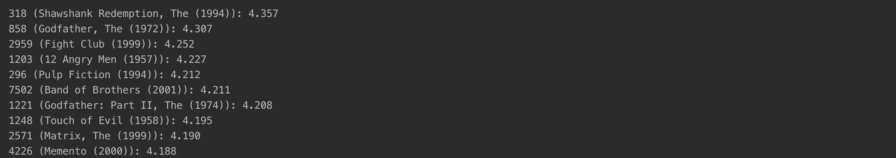
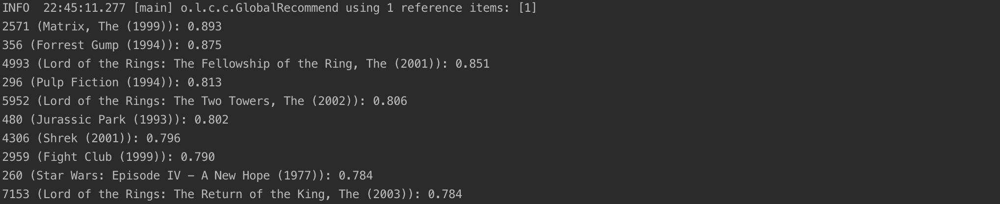
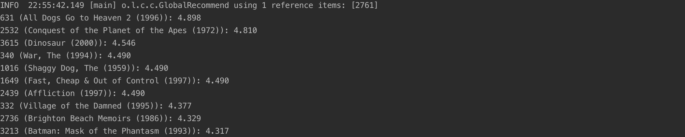

# Non-Personalized Recommender Assignment

The assignment includes implemention of Non-Personalized Recommender System with Excel and Java. 

## Java Results Screenshots

Mean:

Damped Mean:

Basic Association:

Lift Association:

## Excel Explanation

There are 7 deliverables for this assignment. Each deliverable represents a different analysis of the data provided to you. The first three deliverables represent non-personalized summary statistics; the next two represent product association using two different mechanisms (we aren't using lift here because of how similar the popularity levels are). The last two represent a demographic analysis to explore whether using gender would be wise given this dataset. Each question has its own "quiz" in which the responses are entered.

1. Mean Rating: Calculate the mean rating for each movie, order with the highest rating listed first, and submit the top three (along with the mean scores for the top two).

2. Rating Count (popularity): Count the number of ratings for each movie, order with the most number of ratings first, and submit the top three (along with the counts for the top two).

3. % of ratings 4+ (liking): Calculate the percentage of ratings for each movie that are 4 or higher. Order with the highest percentage first, and submit the top three (along with the percentage for the top two). Notice that the three different measures of "best" reflect different priorities and give different results; this should help you see why you need to be thoughtful about what metrics you use.

4. Top movies for someone who has seen Toy Story: Calculate movies that most often occur with Movie #1: Toy Story, using the (x+y)/x method described in class. In other words, for each movie, calculate the percentage of Toy Story raters who also rated that movie. Order with the highest percentage first, and submit the top 3 (along with the correlations for the top two). Note, you will have ties -- to break the ties, use the lowest-numbered movie as the higher-ranked one. In other words, if Movies 541 and 318 are tied, then 318 gets the higher rank.

5. Correlation with Toy Story: Calculate the correlation between the vectors of ratings for Toy Story and each other movie. You can use the built-in CORREL() function. Order by the highest correlation (positive only) and submit the top 3 along with the correlation values for the top 2. Notice the differences between co-occurrence and correlation; these metrics are showing different types of relationships.

6. Mean rating difference by gender: First, recompute the mean rating for each movie separately for males and for females. And calculate the overall mean rating (across all ratings) for males and females. Submit the two movies that have the greatest differences (one where men are most above women, and one where women are most above men) along with the differences in average. Also submit the difference in overall rating averages (female average - male average).

7. Next, compute the % of ratings 4+ separately for males and females. You'll be asked to submit two movies as above (largest difference in each direction). And again you'll indicate whether men or women are more likely to rate movies 4 stars or above.

