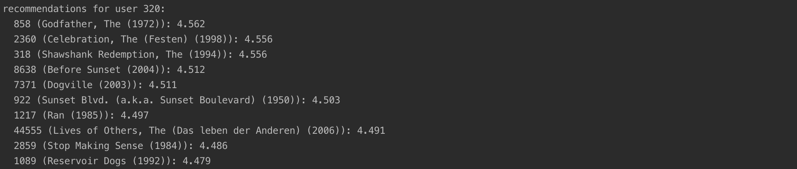

# User-User Collaborative Filtering Recommender 

This assignment includes implementation of User-User Collaborative Filtering Recommender with Excel and Java.

## Use Case

Assumption: We have the matrix of user-item ratings.

Target: Provide personalized recommendation.

## Java Results Screenshots

Recommendation with User-User Collaborative Filtering:

## Java Code Explanation

Only One class SimpleUserUserItemScorer. Method scoreWithDetails:
1. Get normalized ratings for each user (minus each user's average rating)
2. Calculate Cosine Similarity (Ignore negative value)
3. Select nearest neighbors by sorting cosine similarity in descending order
4. Iterate to calculate the predicted rating for each item given a user (Limit the nearest neighborhood to 30)
5. Return the result, give recommendation

## Excel Explanation

#### Part 1 - Without Normalization

First, you will implement user-user collaborative filtering without normalization.

1. Start by downloading the starting spreadsheet. This is a 25 user x 100 movie matrix of ratings selected from the class data set. The spreadsheet has three sheets in it (this is not supposed to be an exercise in spreadsheet tricks; as a result, we’ve already given you a significant start). 1) The first sheet is a ratings matrix with movies as rows and users as columns, 2) The second sheet is a ratings matrix with movies as columns and users as rows, and 3) The third sheet is the start of your correlations matrix.

2. Open the sample matrix in your favorite spreadsheet program. Note that the matrix contains a significant number of missing values -- do not replace these with zeroes, they are correctly missing.

3. Complete the user-by-user correlations matrix. To check your math, note that the correlation between users 1648 and 5136 is 0.40298, and the correlation between users 918 and 2824 is -0.31706. All correlations should be between -1 and 1, and the diagonal should be all 1's (since they are self-correlations).

4. Identify the top 5 neighbors (the users with the 5 largest, positive correlations) for users 3867 and 89. For example, if the target user were #3712, the closest neighbors are 2824 (corr: 0.46291), 3867 (corr: 0.400275), 5062 (corr: 0.247693), 442 (corr: 0.22713), and 3853 (corr: 0.19366). Don't forget to exclude the target user (corr: 1.0) from your possible selections.

5. Create a new worksheet in your spreadsheet, and use it to compute the predictions for each movie for users 3867 and 89 by taking the correlation-weighted average of the ratings of the top-five neighbors (for each target user) for each movie
Remember, you will need to make sure that your weight for each contributed rating is the user-user correlation when that neighbor has rated the movie, but 0 when the neighbor has not rated the movie).

#### Part 2 - Normalization

Next, you will repeat the computation but this time you will normalize the scores.

Repeat step 5 from part 1. This time, however, use the normalization formula.
