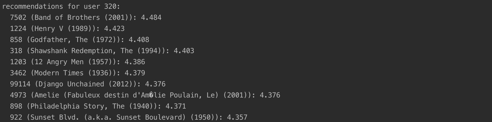
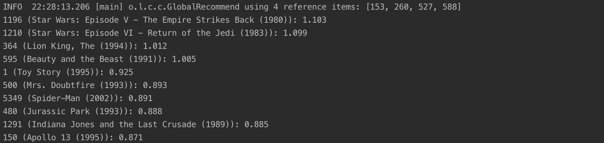

# Content-Based Recommender 

This assignment includes implementation of Content-Based Recommender with Excel and Java.

## Use Case

Assumption: We have the data of user rating and item tag (in our case assigned by users).

Target: Provide personalized recommendation.

## Java Results Screenshots

Recommendation for user 320:

Find similar items with reference items 153, 260, 527, 588:

## Java Code Explanation

SimpleItemItemModel: Store itemMeans and neighbors. itemMean is the vector of item mean ratings and neighbors are neighbors of the item, sorted by decreasing score.

SimpleItemItemModelProvider: Provide the detailed methods to compute itemMeans and neighbors of SimpleItemItemModel.

SimpleItemItemScorer: Provide detailed methods to recommend items given a user. First normalize the user's ratings by subtracting the item mean from each one and then compute the user's score for each item.

SimpleItemBasedItemScorer: Provide detailed methods to recommend similar items given a set of reference items.

## Excel Explanation

#### Spreadsheet Layout
In the spreadsheet, you will find 4 sheets: Ratings contains the raw rating data, and NormRatings contains the normalized ratings (each rating adjusted with the user’s mean rating). You will fill out Matrix with the similarities between all items, and FilterMatrix is a filtered view of Matrix where all negative similarities are clamped to 0 (to exclude negative similarities from the computation).

The Ratings and NormRatings sheets also contain the L2 norm (Euclidean length, or square root of sum of squares) of each movie’s ratings.

For each similarity variant, you will fill out the Matrix sheet; use the FilterMatrix sheet to compute recommendations.

#### Similarity Functions
Your core task in this assignment is to compute item similarities using 2 different similarity functions:

Cosine similarity between items using raw (unnormalized) ratings.
Cosine similarity using adjusted (normalized) ratings.
For the numerator of the similarity, you will probably want to use the SUMPRODUCT function; the provided L2 norms will be useful for computing the denominators.

#### Deliverables
The output you are supposed to turn in consists of 2 parts. For each part, submit both unnormalized and normalized results.

#### Top 5 Toy Story
Provide 5 movies most similar to Toy Story, in decreasing order of similarity. Only provide the movie ID, not the title.

#### Top 5 for User 5277
Provide the top 5 recommended movies for user 5277, using an average of the user’s ratings weighted by similarity to each candidate movie. You do not need to exclude movies they have rated. Consider all movies with nonnegative similarities (do not limit neighborhood size).
