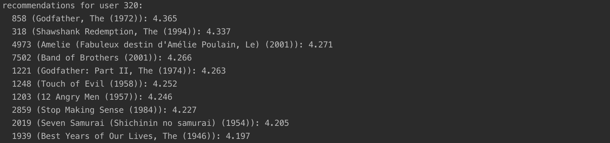

# Matrix Factorization Recommender 

This assignment includes implementation of Matrix Factorization Recommender with Excel and Java.

## Use Case

Assumption: We have the data of user rating.

Target: Provide personalized recommendation.

## Java Results Screenshots

Recommendation for user 320:

## Java Code Explanation

LatentFeatureCount: Parameter controlling the number of latent features to retain.

SVDModel: SVD model for collaborative filtering.

SVDModelBuilder: Model builder that computes the SVD model.

SVDItemScorer: SVD-based item scorer.

## Excel Explanation

#### Spreadsheet Layout

This spreadsheet has 2 sheets: an Items sheet and Users sheet.

The Items sheet contains the feature values for 100 items and 15 features, along with the weight (singular value) for each feature.

The Users sheet contains the feature values for 20 users and those 15 features.

#### Deliverables

Compute the top 5 movies for user 4469. Only provide the movie IDs of the 5 recommendations.