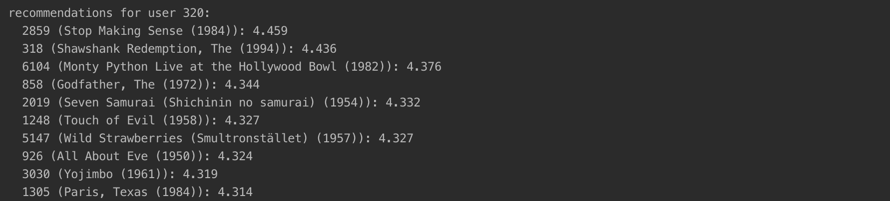

# Hybrid Recommender 

This assignment includes implementation of Hybrid Recommender with Java.

## Java Results Screenshots

Linear Hybrid Recommendation for user 320 with weight = 0.5:

## Java Code Explanation

#### cbf folder

TagData: Class containing entity type and attribute definitions for accessing tag data

LuceneItemItemModel: The Lucene-backed CBF model

LuceneModelBuilder: Class to build Lucene Model

#### hybrid folder

BlendWeight: The blending weight parameter for blending item scorers

Left: Qualifier for the left item scorer

Right: Qualifier for the right item scorer

LinearBlendItemScorer: Item scorer that computes a linear blend of two scorers' scores

LogisticModel: Model class for logistic regression, used to build models

LogisticModelProvider: Trainer that builds logistic models

LogisticTrainingSplit: Manages a train-tune split for training component recommenders and a logistic regression blend of them

LogisticItemScorer: Item scorer that does a logistic blend of a subsidiary item scorer and popularity. It tries to predict whether a user has rated a particular item.

RecommenderConfigurationList: A list of recommender configurations

RecommenderEngineList: A list of recommender engines

RecommenderList: A list of recommenders

